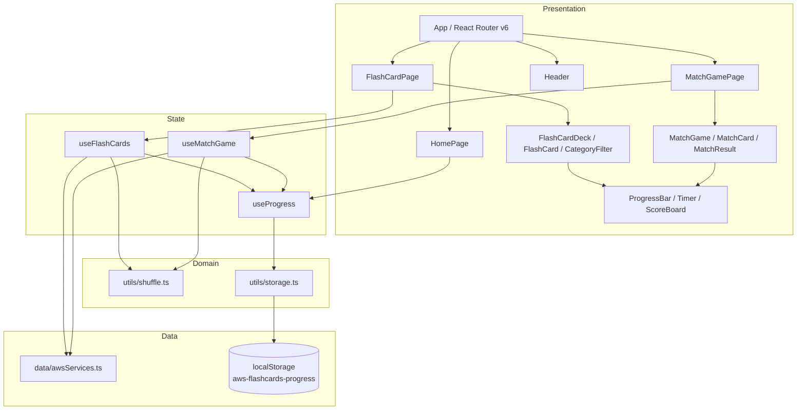
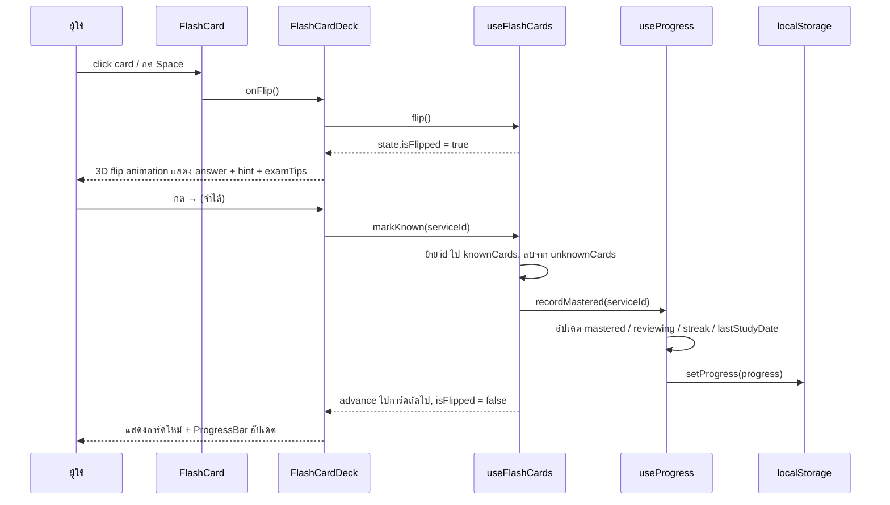
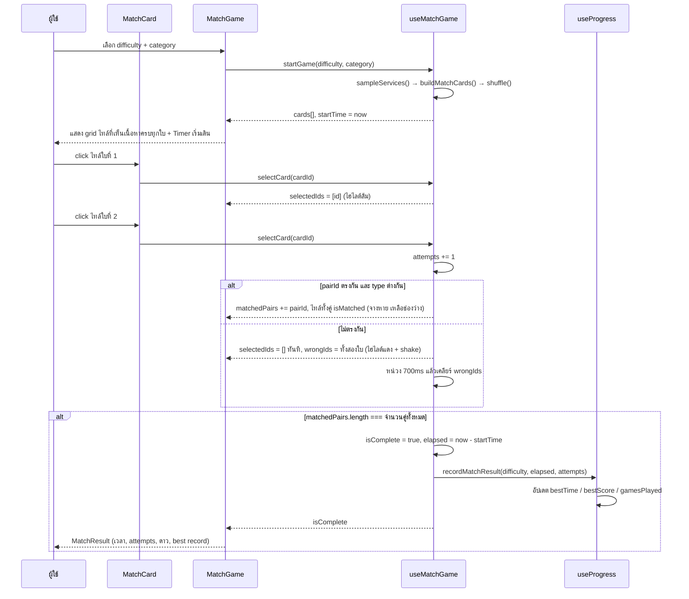
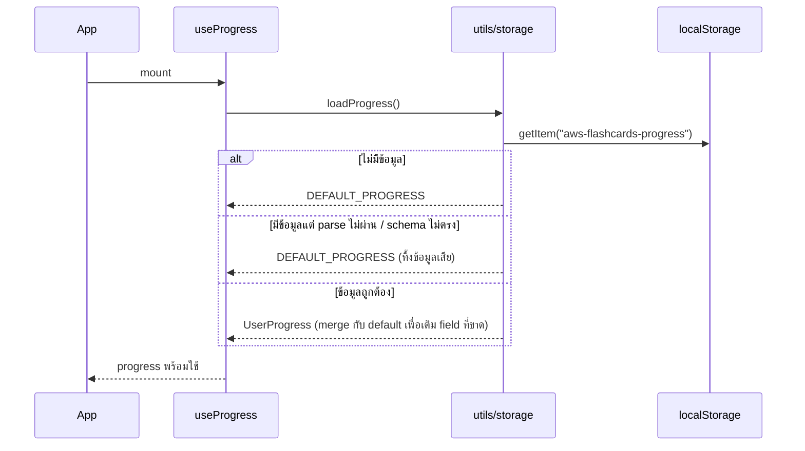

# Design Document: AWS Flash Cards & Match Game (CLF-C02)

## Overview

AWS Flash Cards เป็น Single Page Application แบบ client-only สำหรับฝึกจำ AWS Services เพื่อเตรียมสอบ AWS Certified Cloud Practitioner (CLF-C02) ตัวแอปมีสองโหมดการเรียน: **Flash Cards** (การ์ดพลิกได้พร้อมระบบ mark จำได้/ยังไม่แม่น) และ **Match Game** (เกมจับคู่ชื่อ service กับคำอธิบาย แบบเดียวกับ Match ของ Quizlet) โดย UI ทั้งหมดเป็นภาษาไทย ส่วน code comments เป็นภาษาอังกฤษ

> **หมายเหตุการเปลี่ยนกลไก Match Game:** เดิมออกแบบไว้เป็นเกมความจำ (memory game) ที่การ์ดคว่ำหน้าและเปิดทีละสองใบ ภายหลังเปลี่ยนตามที่ผู้ใช้ต้องการให้เป็น **การจับคู่แบบเห็นทุกใบตั้งแต่แรก** เหมือน Quizlet Match คือผู้เล่นคลิกไทล์ชื่อ service แล้วคลิกไทล์คำอธิบายที่คู่กัน ความท้าทายอยู่ที่การอ่านและจับคู่ให้เร็ว ไม่ใช่การจำตำแหน่งการ์ด เอกสารนี้สะท้อนกลไกใหม่แล้ว

ระบบไม่มี backend เลย — ข้อมูล AWS services ทั้ง 80+ รายการถูก embed เป็น static TypeScript array ใน source code และความก้าวหน้าของผู้ใช้ (mastered / reviewing / streak / best scores) ถูกเก็บใน `localStorage` ภายใต้ key เดียวคือ `aws-flashcards-progress` ทำให้ deploy เป็น static site ได้ทันทีและทำงานแบบ offline-first

สถาปัตยกรรมแบ่งเป็น 4 ชั้นชัดเจน: **Data layer** (static dataset + storage utilities), **Domain logic layer** (pure functions สำหรับ shuffle, matching, scoring, streak), **State layer** (custom hooks: `useFlashCards`, `useMatchGame`, `useProgress`) และ **Presentation layer** (pages + components ที่เป็น presentational เป็นหลัก) การแยกชั้นนี้ทำให้ logic ส่วนที่สำคัญเป็น pure function ที่ทดสอบด้วย property-based testing ได้ตรง ๆ

## Architecture



**หลักการสำคัญ**

- `utils/` มีแต่ pure functions — ไม่แตะ React, ไม่แตะ DOM (ยกเว้น `storage.ts` ที่ห่อ `localStorage` ไว้ชั้นเดียว)
- Hooks เป็นที่เดียวที่ถือ mutable state และเป็นที่เดียวที่เรียก persistence
- Components รับข้อมูลผ่าน props และยิง callback กลับ — ไม่มี component ใดอ่าน `localStorage` โดยตรง
- `useProgress` เป็น single source of truth ของ persisted state; `useFlashCards` และ `useMatchGame` เรียกใช้เพื่อบันทึก ไม่ใช่เขียนเอง

## Sequence Diagrams

### Flow 1: Flash Card — พลิกการ์ดและ mark ว่าจำได้



### Flow 2: Match Game — เลือกสองไทล์และตรวจคู่



### Flow 3: โหลด progress ตอนเปิดแอป



## Components and Interfaces

โครงสร้าง folder (ตาม spec.md):

```
src/
├── components/
│   ├── layout/Header.tsx
│   ├── flashcard/{FlashCardDeck,FlashCard,CategoryFilter}.tsx
│   ├── match/{MatchGame,MatchCard,MatchResult}.tsx
│   └── ui/{ProgressBar,Timer,ScoreBoard}.tsx
├── data/awsServices.ts
├── hooks/{useFlashCards,useMatchGame,useProgress}.ts
├── pages/{HomePage,FlashCardPage,MatchGamePage}.tsx
├── types/index.ts
├── utils/{shuffle,storage}.ts
├── App.tsx
└── main.tsx
```

### Component: Header

**Purpose**: แถบบนสุดคงที่ทุกหน้า แสดงชื่อแอปและลิงก์นำทาง

```typescript
interface HeaderProps {
  masteredCount: number
  totalCount: number
}
```

**Responsibilities**

- ลิงก์ไป `/`, `/flashcards`, `/match` ด้วย `NavLink` และ highlight route ปัจจุบัน
- แสดงตัวนับ mastered/total ย่อ ๆ

### Component: FlashCardDeck

**Purpose**: ควบคุมลำดับการ์ดและเชื่อม `useFlashCards` เข้ากับ UI รวมถึงผูก keyboard shortcuts

```typescript
interface FlashCardDeckProps {
  services: AWSService[]
  mode: 'all' | 'review'
}
```

**Responsibilities**

- เรียก `useFlashCards` และส่ง state ลง `FlashCard`, `CategoryFilter`, `ProgressBar`
- ผูก `keydown` listener: `Space` = พลิก, `ArrowLeft` = ยังไม่แม่น, `ArrowRight` = จำได้, `ArrowUp`/`ArrowDown` = การ์ดก่อนหน้า/ถัดไป, `S` = สุ่มใหม่
- แสดงปุ่ม: ✓ จำได้ / ✗ ยังไม่แม่น / ข้าม / สุ่มใหม่
- แสดงสถานะว่าง (empty state) เมื่อ filter แล้วไม่มีการ์ดเหลือ

### Component: FlashCard

**Purpose**: การ์ดใบเดียวที่พลิกได้ด้วย CSS 3D transform

```typescript
interface FlashCardProps {
  service: AWSService
  isFlipped: boolean
  onFlip: () => void
}
```

**Responsibilities**

- ด้านหน้า: `name` + `fullName` + badge หมวด (สีตาม category)
- ด้านหลัง: `answer` + `hint` + `examTips` (ซ่อนส่วน examTips ถ้าไม่มี)
- Animation: `perspective` + `rotateY(180deg)`, transition 0.4s
- Accessibility: `role="button"`, `tabIndex={0}`, `aria-pressed={isFlipped}`, รองรับ Enter/Space

### Component: CategoryFilter

**Purpose**: ปุ่มเลือกหมวดพร้อมจำนวนการ์ดในแต่ละหมวด

```typescript
interface CategoryFilterProps {
  counts: Record<Category | 'all', number>
  selected: Category | 'all'
  onSelect: (category: Category | 'all') => void
}
```

**Responsibilities**

- ปุ่มหนึ่งใบต่อหนึ่งหมวด + ปุ่ม "ทั้งหมด" แสดงจำนวนกำกับ
- ใช้สีประจำหมวดตามตาราง UI Design Guidelines
- `aria-pressed` บนปุ่มที่เลือกอยู่

### Component: MatchGame

**Purpose**: กระดานเกมจับคู่ + หน้าจอเลือก difficulty

```typescript
interface MatchGameProps {
  services: AWSService[]
  onBackHome: () => void
}
```

**Responsibilities**

- ก่อนเริ่ม: ให้เลือก `difficulty` และ `category` (optional)
- ระหว่างเล่น: render grid ของ `MatchCard` (responsive 2–4 columns), `Timer`, ตัวนับ attempts
- ส่ง `isSelected` / `isWrong` ลงแต่ละไทล์จาก `state.selectedIds` และ `state.wrongIds`
- ไม่ล็อกกระดาน: ทายผิดแล้วคลิกต่อได้ทันที การไฮไลต์แดงเป็นเพียง feedback ชั่วคราว
- เมื่อจบเกม: render `MatchResult`

### Component: MatchCard

**Purpose**: ไทล์หนึ่งใบในกระดานเกม แสดงเนื้อหาให้เห็นตั้งแต่แรก ไม่มีการพลิก

```typescript
interface MatchCardProps {
  card: MatchCard
  isSelected: boolean
  isWrong: boolean
  onSelect: (cardId: string) => void
}
```

**Responsibilities**

- ชนิด `service`: ชื่อย่อตัวหนาขนาดใหญ่ พร้อมชื่อเต็ม (`subtitle`) เป็นบรรทัดรองสีอ่อนด้านล่าง เพื่อให้ผู้เล่นจำได้ว่าตัวย่อย่อมาจากอะไรในโหมดนี้ด้วย
- ชนิด `description`: ข้อความคำอธิบายขนาดเล็กกว่า ไม่มีบรรทัดรอง
- สถานะปกติ: พื้นขาว ขอบเทา และ hover เป็นโทม indigo
- สถานะ `isSelected`: ขอบและ ring สีส้ม พร้อม `aria-pressed="true"`
- สถานะ `isWrong`: ขอบและ ring สีแดง + `animate-shake`
- สถานะ `isMatched`: คืนช่องว่างเส้นประสีเขียวแทนปุ่ม (ไม่ render `<button>` และ `aria-hidden`) เพื่อคงขนาด grid ไม่ให้ layout ขยับ
- ทุกไทล์ใช้ `min-h-[8.5rem]` เพื่อให้แถวสูงเท่ากันแม้คำอธิบายยาวไม่เท่ากัน
- ห่อด้วย `React.memo` เพราะกระดานระดับ hard มี 16 ไทล์แต่เปลี่ยนครั้งละไม่กี่ใบ

### Component: MatchResult

**Purpose**: สรุปผลเมื่อจบเกม

```typescript
interface MatchResultProps {
  difficulty: Difficulty
  elapsedSeconds: number
  attempts: number
  stars: 1 | 2 | 3
  bestTime: number | null
  bestScore: number | null
  onPlayAgain: () => void
  onBackHome: () => void
}
```

### Component: ProgressBar / Timer / ScoreBoard

```typescript
interface ProgressBarProps {
  value: number   // 0..total
  total: number
  label?: string
}

interface TimerProps {
  startTime: number | null  // epoch ms; null = ยังไม่เริ่ม
  isRunning: boolean
}

interface ScoreBoardProps {
  known: number
  unknown: number
  remaining: number
}
```

`Timer` คำนวณเวลาที่ผ่านไปจาก `Date.now() - startTime` ทุก 1 วินาทีด้วย `setInterval` (ไม่สะสมค่าเอง เพื่อไม่ให้ drift) และเคลียร์ interval ตอน unmount

## Data Models

### `types/index.ts`

```typescript
export type Category =
  | 'Compute'
  | 'Storage'
  | 'Database'
  | 'Networking'
  | 'Security'
  | 'Serverless'
  | 'Management'
  | 'AI/ML'
  | 'Migration'
  | 'Billing'

export type Difficulty = 'easy' | 'medium' | 'hard'

export interface AWSService {
  id: string          // kebab-case unique key, e.g. "ec2", "s3-glacier"
  name: string        // e.g. "EC2"
  fullName: string    // e.g. "Elastic Compute Cloud"
  category: Category
  description: string // คำอธิบายสั้นภาษาไทย (ใช้เป็นการ์ด description ใน Match Game)
  answer: string      // หน้าที่หลัก (ไทย + ศัพท์เทคนิคอังกฤษ)
  hint: string        // เคล็ดลับจำ / use case จริง
  examTips?: string   // จุดที่มักออกสอบ CLF-C02
}

export interface FlashCardState {
  currentIndex: number
  isFlipped: boolean
  knownCards: string[]
  unknownCards: string[]
  category: Category | 'all'
}

export interface MatchCard {
  id: string          // `${pairId}-service` | `${pairId}-description`
  pairId: string      // service id — ใช้จับคู่
  content: string     // service name หรือ description
  subtitle?: string   // ชื่อเต็มของตัวย่อ เช่น "Elastic Compute Cloud" ใต้ "EC2"
  type: 'service' | 'description'
  isMatched: boolean  // ไม่มี isFlipped: ทุกไทล์เห็นเนื้อหาตั้งแต่แรก
}

export interface MatchGameState {
  cards: MatchCard[]
  selectedIds: string[]   // ไทล์ที่เลือกอยู่ ยาวไม่เกิน 2
  wrongIds: string[]      // ไทล์ที่ทายผิด สำหรับ feedback สีแดงชั่วคราว
  matchedPairs: string[]
  attempts: number
  startTime: number | null
  isComplete: boolean
  difficulty: Difficulty
}

export interface UserProgress {
  flashCards: {
    totalStudied: number
    mastered: string[]
    reviewing: string[]
    lastStudyDate: string        // ISO date "YYYY-MM-DD"
    streak: number
  }
  matchGame: {
    gamesPlayed: number
    bestTime: Record<string, number>   // difficulty → best seconds
    bestScore: Record<string, number>  // difficulty → least attempts
    lastPlayDate: string
  }
}
```

**Validation Rules — AWSService**

- `id` ต้องไม่ซ้ำกันทั้ง dataset และเป็น kebab-case `^[a-z0-9-]+$`
- `name`, `fullName`, `description`, `answer`, `hint` ต้องไม่ใช่สตริงว่าง
- `category` ต้องเป็นหนึ่งใน 10 ค่าของ `Category`
- จำนวนต่อหมวดตาม spec.md: Compute 10, Storage 7, Database 8, Networking 12, Security 15, Serverless 5, Management 8, AI/ML 11, Migration 3, Billing 10 → รวม 89 services

**Validation Rules — MatchGameState**

- `selectedIds.length ≤ 2` เสมอ
- ทุก id ใน `selectedIds` ต้องชี้ไทล์ที่ `isMatched === false`
- `selectedIds` ไม่มีค่าซ้ำ (คลิกไทล์เดิมซ้ำคือการยกเลิกการเลือก)
- `cards.length === pairCount × 2` โดย `pairCount` = 4 / 6 / 8 ตาม difficulty
- ทุก `pairId` ปรากฏใน `cards` เป็นจำนวน 2 ใบ: หนึ่งใบ `type === 'service'` และหนึ่งใบ `type === 'description'`

**Validation Rules — UserProgress**

- `mastered` และ `reviewing` ต้องไม่มี id ร่วมกัน (disjoint sets) และไม่มีค่าซ้ำภายในตัวเอง
- ทุก id ใน `mastered`/`reviewing` ต้องมีอยู่ใน dataset
- `streak ≥ 0`, `gamesPlayed ≥ 0`, `totalStudied ≥ 0`
- ค่าใน `bestTime` / `bestScore` ต้องเป็นจำนวนบวก

### localStorage Schema

Key: `"aws-flashcards-progress"` — ค่าเป็น JSON ของ `UserProgress`

```json
{
  "flashCards": {
    "totalStudied": 45,
    "mastered": ["ec2", "lambda", "s3"],
    "reviewing": ["vpc", "iam"],
    "lastStudyDate": "2026-08-21",
    "streak": 3
  },
  "matchGame": {
    "gamesPlayed": 12,
    "bestTime": { "easy": 25, "medium": 48, "hard": 95 },
    "bestScore": { "easy": 5, "medium": 9, "hard": 14 },
    "lastPlayDate": "2026-08-21"
  }
}
```

## Key Functions with Formal Specifications

### `shuffle<T>(items: readonly T[], rng?: () => number): T[]`

Fisher–Yates shuffle แบบ pure — คืน array ใหม่ ไม่แก้ input รับ `rng` ได้เพื่อให้ test กำหนดผลลัพธ์ได้

**Preconditions**

- `items` เป็น array (อาจว่างได้)
- ถ้าส่ง `rng` มา ต้องคืนค่าใน `[0, 1)`

**Postconditions**

- `result.length === items.length`
- `result` เป็น permutation ของ `items` (multiset เท่ากัน)
- `items` ไม่ถูกแก้ไข

**Loop Invariants**

- ที่การวนรอบ index `i` (นับจากท้าย): ช่วง `result[i+1..n-1]` ถูกสุ่มเสร็จแล้วและเป็น subset ของ `items` ที่ไม่ซ้ำกับช่วงที่เหลือ
- ทุกองค์ประกอบของ `items` อยู่ใน `result` เสมอตลอดการวน

### `sampleServices(services, count, category?, rng?): AWSService[]`

สุ่มเลือก services แบบไม่ซ้ำสำหรับสร้างกระดานเกม

**Preconditions**

- `count > 0`
- ถ้าระบุ `category` จำนวน service ในหมวดนั้นต้อง `≥ count`; ถ้าไม่พอให้ fallback ไปสุ่มจากทุกหมวด

**Postconditions**

- `result.length === count`
- ทุก `id` ใน `result` ไม่ซ้ำกัน
- ถ้าระบุ `category` และหมวดนั้นมีพอ ทุกตัวใน `result` มี `category` ตามที่ระบุ

### `buildMatchCards(services: AWSService[], rng?): MatchCard[]`

**Preconditions**

- `services` มี id ไม่ซ้ำและมีอย่างน้อย 1 ตัว

**Postconditions**

- `result.length === services.length * 2`
- สำหรับทุก service มีการ์ด `type: 'service'` (content = `name`) และ `type: 'description'` (content = `description`) ที่ `pairId` = service id
- การ์ด `type: 'service'` มี `subtitle = fullName` เมื่อ `fullName ≠ name` และไม่มี `subtitle` เมื่อทั้งสองค่าเท่ากัน; การ์ด `type: 'description'` ไม่มี `subtitle` เสมอ
- `subtitle` ไม่มีผลต่อการจับคู่ — `isMatch` พิจารณาเฉพาะ `pairId` และ `type`
- ทุกการ์ดเริ่มต้นด้วย `isMatched === false`
- ตำแหน่งการ์ดถูกสับ

### `isMatch(a: MatchCard, b: MatchCard): boolean`

**Preconditions**

- `a` และ `b` เป็นการ์ดต่างใบ (`a.id !== b.id`)

**Postconditions**

- คืน `true` เมื่อและเมื่อ `a.pairId === b.pairId && a.type !== b.type`
- ไม่มี side effect

### `calculateStars(attempts: number, pairCount: number): 1 | 2 | 3`

**Preconditions**

- `attempts ≥ pairCount` (ต้องเปิดคู่อย่างน้อยเท่าจำนวนคู่จึงจะจบเกม)
- `pairCount > 0`

**Postconditions**

- `attempts ≤ pairCount + 2` → `3`
- `pairCount + 2 < attempts ≤ pairCount * 2` → `2`
- `attempts > pairCount * 2` → `1`
- ผลลัพธ์เป็น monotonically non-increasing ตาม `attempts` ที่เพิ่มขึ้น

### `calculateStreak(lastDate: string, today: string, currentStreak: number): number`

**Preconditions**

- `lastDate` และ `today` เป็น ISO date `YYYY-MM-DD` ที่ valid หรือ `lastDate` เป็นสตริงว่าง (ยังไม่เคยเรียน)
- `currentStreak ≥ 0`

**Postconditions**

- ถ้า `lastDate === today` → คืน `currentStreak` (ไม่นับซ้ำในวันเดียว)
- ถ้า `today` เป็นวันถัดจาก `lastDate` พอดี → คืน `currentStreak + 1`
- ถ้าห่างมากกว่า 1 วัน หรือ `lastDate` ว่าง → คืน `1`
- ผลลัพธ์ `≥ 1` เสมอเมื่อมีการเรียนในวันนั้น

### `loadProgress(): UserProgress` / `saveProgress(p: UserProgress): void`

**Preconditions (load)**

- ไม่มี — ต้องทนได้ทุกกรณีของค่าที่อยู่ใน localStorage

**Postconditions (load)**

- คืน object ที่ conform กับ `UserProgress` เสมอ
- ถ้า key ไม่มี / JSON เสีย / shape ไม่ตรง → คืน `DEFAULT_PROGRESS`
- ถ้าข้อมูลถูกต้องบางส่วน → merge กับ `DEFAULT_PROGRESS` เพื่อเติม field ที่ขาด

**Postconditions (save)**

- ค่าที่ถูกเขียนสามารถ `loadProgress()` กลับมาได้เท่าเดิม (round-trip)
- ถ้า localStorage ใช้ไม่ได้ (quota เต็ม / โหมด private) → กลืน exception และคง in-memory state ไว้ ไม่ทำให้แอปพัง

### `markKnown(state, serviceId)` / `markUnknown(state, serviceId)`

**Preconditions**

- `serviceId` มีอยู่ใน dataset
- `state.knownCards` และ `state.unknownCards` disjoint

**Postconditions**

- `markKnown`: `serviceId ∈ knownCards` และ `serviceId ∉ unknownCards`
- `markUnknown`: `serviceId ∈ unknownCards` และ `serviceId ∉ knownCards`
- ทั้งสองยัง disjoint หลังเรียก และไม่มี id ซ้ำภายในลิสต์เดียว (idempotent เมื่อเรียกซ้ำด้วย id เดิม)
- `state` เดิมไม่ถูก mutate — คืน state ใหม่

## Algorithmic Pseudocode

### Flash Card deck filtering และ navigation

```pascal
ALGORITHM buildDeck(services, category, mode, progress)
INPUT: services: AWSService[], category: Category | 'all',
       mode: 'all' | 'review', progress: UserProgress
OUTPUT: deck: AWSService[]

BEGIN
  filtered ← services

  IF category ≠ 'all' THEN
    filtered ← FILTER filtered WHERE service.category = category
  END IF

  IF mode = 'review' THEN
    filtered ← FILTER filtered WHERE service.id ∉ progress.flashCards.mastered
  END IF

  ASSERT ∀ s ∈ filtered : s ∈ services
  RETURN shuffle(filtered)
END
```

**Preconditions**: `services` มี id ไม่ซ้ำ; `progress` conform กับ `UserProgress`
**Postconditions**: `deck` เป็น subset ของ `services`; ในโหมด review ไม่มีการ์ดที่ mastered แล้ว; ถ้า `category ≠ 'all'` ทุกการ์ดอยู่ในหมวดนั้น
**Loop Invariants**: ทุก element ที่ผ่าน filter ยังคงเป็น reference เดิมจาก `services` (ไม่มีการ clone หรือแก้ค่า)

### Advance card (วน index แบบปลอดภัย)

```pascal
ALGORITHM advance(state, deckLength, direction)
INPUT: state: FlashCardState, deckLength: integer, direction: +1 | -1
OUTPUT: newState: FlashCardState

BEGIN
  IF deckLength = 0 THEN
    RETURN state WITH currentIndex ← 0, isFlipped ← false
  END IF

  next ← (state.currentIndex + direction + deckLength) MOD deckLength

  ASSERT 0 ≤ next < deckLength

  RETURN state WITH currentIndex ← next, isFlipped ← false
END
```

**Preconditions**: `deckLength ≥ 0`; `0 ≤ state.currentIndex < max(deckLength, 1)`
**Postconditions**: `0 ≤ newState.currentIndex < deckLength` (หรือ 0 เมื่อ deck ว่าง); `isFlipped` เป็น false เสมอหลังเปลี่ยนการ์ด
**Loop Invariants**: N/A

### Match Game — flip และตรวจคู่

```pascal
ALGORITHM handleFlip(state, cardIndex)
INPUT: state: MatchGameState, cardIndex: integer
OUTPUT: newState: MatchGameState, pendingReset: boolean

BEGIN
  card ← state.cards[cardIndex]

  // Guard: ปฏิเสธการคลิกที่ไม่ถูกต้อง
  IF card.isMatched OR cardIndex ∈ state.flippedIndices
     OR |state.flippedIndices| = 2 OR state.isComplete THEN
    RETURN state, false
  END IF

  newFlipped ← state.flippedIndices + [cardIndex]
  state.cards[cardIndex].isFlipped ← true

  IF |newFlipped| < 2 THEN
    RETURN state WITH flippedIndices ← newFlipped, false
  END IF

  // ครบสองใบ → นับ attempt แล้วตรวจ
  attempts ← state.attempts + 1
  first ← state.cards[newFlipped[0]]
  second ← state.cards[newFlipped[1]]

  IF isMatch(first, second) THEN
    MARK first.isMatched ← true
    MARK second.isMatched ← true
    matched ← state.matchedPairs + [first.pairId]

    ASSERT |matched| ≤ |state.cards| / 2

    complete ← (|matched| = |state.cards| / 2)

    RETURN state WITH matchedPairs ← matched,
                      flippedIndices ← [],
                      attempts ← attempts,
                      isComplete ← complete,
           false
  ELSE
    // เก็บ flippedIndices ไว้เพื่อให้ UI แสดงสองใบก่อนพลิกกลับ
    RETURN state WITH attempts ← attempts, flippedIndices ← newFlipped, true
  END IF
END
```

**Preconditions**: `0 ≤ cardIndex < |state.cards|`; `|state.flippedIndices| ≤ 2`; state conform กับ validation rules
**Postconditions**: `|newState.flippedIndices| ≤ 2`; `attempts` เพิ่มขึ้นเฉพาะเมื่อเปิดครบสองใบ; การ์ดที่ matched แล้วยังคง matched ตลอดไป; `isComplete = true` เมื่อและเมื่อจับคู่ครบทุกคู่
**Loop Invariants**: N/A (ไม่มี loop) — แต่คงค่าคงที่ระดับ state: `|matchedPairs| × 2 + |flippedIndices| ≤ |cards|`

```pascal
ALGORITHM resetUnmatched(state)
INPUT: state: MatchGameState
OUTPUT: newState: MatchGameState

BEGIN
  FOR each index i IN state.flippedIndices DO
    ASSERT state.cards[i].isMatched = false
    state.cards[i].isFlipped ← false
  END FOR

  RETURN state WITH flippedIndices ← []
END
```

**Preconditions**: ทุก index ใน `flippedIndices` ชี้การ์ดที่ยังไม่ matched
**Postconditions**: `flippedIndices` ว่าง; การ์ดที่ matched ไม่ถูกกระทบ
**Loop Invariants**: การ์ดทุกใบที่ประมวลผลแล้วมี `isFlipped = false` และ `isMatched` ไม่เปลี่ยน

### บันทึกผล Match Game

```pascal
ALGORITHM recordMatchResult(progress, difficulty, seconds, attempts, today)
INPUT: progress: UserProgress, difficulty: Difficulty,
       seconds: integer, attempts: integer, today: ISO date
OUTPUT: newProgress: UserProgress

BEGIN
  ASSERT seconds > 0 AND attempts > 0

  games ← progress.matchGame.gamesPlayed + 1

  prevTime ← progress.matchGame.bestTime[difficulty]
  bestTime ← IF prevTime = undefined THEN seconds ELSE MIN(prevTime, seconds)

  prevScore ← progress.matchGame.bestScore[difficulty]
  bestScore ← IF prevScore = undefined THEN attempts ELSE MIN(prevScore, attempts)

  ASSERT bestTime ≤ seconds AND bestScore ≤ attempts

  RETURN progress WITH matchGame ← {
    gamesPlayed: games,
    bestTime: progress.matchGame.bestTime WITH [difficulty] ← bestTime,
    bestScore: progress.matchGame.bestScore WITH [difficulty] ← bestScore,
    lastPlayDate: today
  }
END
```

**Preconditions**: `progress` conform กับ `UserProgress`; `seconds > 0`; `attempts > 0`
**Postconditions**: `bestTime[difficulty]` ไม่เคยเพิ่มขึ้น (monotonically non-increasing); `bestScore[difficulty]` ไม่เคยเพิ่มขึ้น; `gamesPlayed` เพิ่มขึ้นทีละ 1; difficulty อื่นไม่ถูกกระทบ
**Loop Invariants**: N/A

## Example Usage

```typescript
// hooks/useFlashCards.ts — public surface
const {
  deck,            // AWSService[]
  current,         // AWSService | null
  isFlipped,
  stats,           // { known: number; unknown: number; remaining: number }
  category,
  flip,
  next,
  prev,
  markKnown,
  markUnknown,
  skip,
  reshuffle,
  setCategory,
} = useFlashCards({ services: awsServices, mode: 'all' })

// FlashCardPage.tsx
;<FlashCardDeck services={awsServices} mode={searchParams.get('mode') === 'review' ? 'review' : 'all'} />

// hooks/useMatchGame.ts — public surface
const {
  state,           // MatchGameState
  pairCount,
  elapsedSeconds,
  stars,           // คำนวณเมื่อ isComplete
  startGame,       // (difficulty, category?) => void
  flipCard,        // (cardId: string) => void
  resetGame,
} = useMatchGame({ services: awsServices })

startGame('medium', 'Security')
flipCard('iam-service')
flipCard('kms-description') // ไม่ตรง → พลิกกลับหลัง 1s, attempts = 1

// utils — pure helpers
import { shuffle } from './utils/shuffle'
import { loadProgress, saveProgress } from './utils/storage'

const deck = shuffle(awsServices.filter((s) => s.category === 'Compute'))
const progress = loadProgress()
saveProgress({ ...progress, flashCards: { ...progress.flashCards, streak: 4 } })
```

## Correctness Properties

*A property is a characteristic or behavior that should hold true across all valid executions of a system—essentially, a formal statement about what the system should do. Properties serve as the bridge between human-readable specifications and machine-verifiable correctness guarantees.*

> หมายเหตุ: ช่อง **Validates** จะถูกเติมด้วยเลข requirement หลังจากสร้าง `requirements.md` ในเฟสถัดไป

### Property 1: Shuffle เป็น permutation

For any array of AWS services, การ shuffle จะได้ผลลัพธ์ที่มีความยาวเท่าเดิมและมีสมาชิกเป็น multiset เดียวกับ input ทุกประการ และ input เดิมไม่ถูกแก้ไข

**Validates: (TBD)**

### Property 2: Deck filter ตรงตามหมวดที่เลือก

For any dataset และหมวดใด ๆ ที่เลือก การ์ดทุกใบใน deck ที่ได้จะอยู่ในหมวดนั้น และไม่มีการ์ดใดในหมวดนั้นหายไปจาก deck

**Validates: (TBD)**

### Property 3: Review mode ไม่แสดงการ์ดที่ mastered แล้ว

For any dataset และ progress ใด ๆ deck ในโหมด review จะไม่มี service id ที่ปรากฏใน `progress.flashCards.mastered`

**Validates: (TBD)**

### Property 4: Navigation index อยู่ในขอบเขตเสมอ

For any deck ที่ไม่ว่างและลำดับการกด next/prev ใด ๆ (ยาวเท่าใดก็ได้) `currentIndex` จะอยู่ในช่วง `[0, deck.length)` ตลอดเวลา และ `isFlipped` เป็น false หลังทุกครั้งที่เปลี่ยนการ์ด

**Validates: (TBD)**

### Property 5: known และ unknown เป็นเซตที่ไม่ทับกัน

For any ลำดับของการ mark known/unknown บน service id ใด ๆ เซต `knownCards` และ `unknownCards` จะไม่มีสมาชิกร่วมกันและไม่มีสมาชิกซ้ำภายในตัวเองเสมอ

**Validates: (TBD)**

### Property 6: การ mark ซ้ำเป็น idempotent

For any service id การเรียก `markKnown` (หรือ `markUnknown`) ซ้ำหลายครั้งด้วย id เดิม ให้ผล state เท่ากับการเรียกครั้งเดียว

**Validates: (TBD)**

### Property 7: กระดานเกมมีคู่ครบและสมดุล

For any จำนวนคู่ที่ถูกต้องและหมวดใด ๆ กระดานที่สร้างขึ้นจะมีการ์ดจำนวน `pairCount × 2` ใบ โดยทุก `pairId` ปรากฏสองใบ — หนึ่งใบชนิด `service` และหนึ่งใบชนิด `description` — และไม่มี service ซ้ำในกระดานเดียว

**Validates: (TBD)**

### Property 8: การจับคู่ถูกต้องเฉพาะการ์ดคู่แท้

For any สองการ์ดต่างใบในกระดาน `isMatch` คืน true เมื่อและเมื่อทั้งสองมี `pairId` เดียวกันและมี `type` ต่างกัน

**Validates: (TBD)**

### Property 9: การ์ดที่ matched แล้วไม่ย้อนกลับ

For any ลำดับการคลิกใด ๆ บนกระดาน การ์ดที่มี `isMatched === true` จะยัง matched ตลอดเกมและไม่ถูกพลิกกลับ

**Validates: (TBD)**

### Property 10: ค่าคงที่ของ state ระหว่างเล่น

For any ลำดับการคลิกใด ๆ จะเป็นจริงเสมอว่า `flippedIndices.length ≤ 2` และ `matchedPairs.length × 2 + flippedIndices.length ≤ cards.length` และ `matchedPairs` ไม่มีค่าซ้ำ

**Validates: (TBD)**

### Property 11: attempts นับเฉพาะการเปิดครบคู่

For any ลำดับการคลิกใด ๆ ค่า `attempts` จะเท่ากับจำนวนครั้งที่มีการเปิดการ์ดใบที่สองสำเร็จ และเป็นค่าที่ไม่ลดลง (monotonically non-decreasing)

**Validates: (TBD)**

### Property 12: เกมจบเมื่อจับคู่ครบเท่านั้น

For any กระดานและลำดับการคลิกใด ๆ `isComplete === true` เมื่อและเมื่อ `matchedPairs.length === cards.length / 2`

**Validates: (TBD)**

### Property 13: ดาวลดลงตาม attempts ที่มากขึ้น

For any `pairCount` และคู่ของค่า attempts `a ≤ b` จะได้ `calculateStars(a, pairCount) ≥ calculateStars(b, pairCount)` และค่าที่คืนอยู่ในเซต `{1, 2, 3}` ตามเกณฑ์ที่กำหนด

**Validates: (TBD)**

### Property 14: Progress round-trip ผ่าน localStorage

For any `UserProgress` ที่ valid การ `saveProgress` แล้ว `loadProgress` จะได้ object ที่เทียบเท่ากับต้นฉบับ

**Validates: (TBD)**

### Property 15: โหลด progress ที่เสียหายได้อย่างปลอดภัย

For any สตริงใด ๆ ที่อยู่ใน localStorage (รวมทั้ง JSON เสีย, JSON ที่ shape ไม่ตรง, ค่าว่าง) `loadProgress` จะคืน object ที่ conform กับ `UserProgress` โดยไม่ throw

**Validates: (TBD)**

### Property 16: Best time / best score ไม่แย่ลง

For any ลำดับผลการเล่นของ difficulty ใด ๆ ค่า `bestTime[difficulty]` และ `bestScore[difficulty]` จะไม่เพิ่มขึ้น และ difficulty อื่นไม่ถูกกระทบ

**Validates: (TBD)**

### Property 17: Streak นับวันติดต่อกันถูกต้อง

For any คู่ของวันที่ที่ valid และ streak ปัจจุบันใด ๆ: เรียนวันเดิมซ้ำ → streak คงเดิม, เรียนวันถัดไปพอดี → streak + 1, ห่างเกินหนึ่งวัน → streak = 1 และผลลัพธ์ `≥ 1` เสมอ

**Validates: (TBD)**

### Property 18: Dataset สมบูรณ์ตามข้อกำหนด

For all services ใน dataset: `id` ไม่ซ้ำและเป็น kebab-case, ฟิลด์บังคับทุกฟิลด์ไม่ว่าง, `category` เป็นค่าที่ถูกต้อง และจำนวนต่อหมวดตรงตามที่กำหนด (Compute 10, Storage 7, Database 8, Networking 12, Security 15, Serverless 5, Management 8, AI/ML 11, Migration 3, Billing 10)

**Validates: (TBD)**

### Property 19: การ์ดแสดงข้อมูลครบทุกฟิลด์ที่มี

For any AWS service เมื่อ render `FlashCard` ในสถานะพลิกแล้ว ผลลัพธ์จะมี `answer` และ `hint` ปรากฏ และมี `examTips` ปรากฏเมื่อและเมื่อ service นั้นมีค่า `examTips`

**Validates: (TBD)**

### Property 20: Keyboard shortcut เทียบเท่าการคลิกปุ่ม

For any สถานะ deck ใด ๆ การกด `Space`, `←`, `→`, `S` ให้ผลลัพธ์ state เดียวกับการคลิกปุ่มพลิก / ยังไม่แม่น / จำได้ / สุ่มใหม่ ตามลำดับ

**Validates: (TBD)**

## Error Handling

### Scenario 1: localStorage อ่านไม่ได้หรือ JSON เสียหาย

**Condition**: `getItem` throw (private mode) หรือค่าที่ได้ parse ไม่ผ่าน / shape ไม่ตรง
**Response**: `loadProgress` จับ exception และคืน `DEFAULT_PROGRESS`
**Recovery**: แอปทำงานต่อด้วย progress เริ่มต้น และการบันทึกครั้งถัดไปจะเขียนทับค่าที่เสีย

### Scenario 2: localStorage เขียนไม่ได้ (quota เต็ม / โหมด private)

**Condition**: `setItem` throw `QuotaExceededError` หรือ `SecurityError`
**Response**: `saveProgress` กลืน exception, log warning ที่ระดับ debug และคง state ใน memory
**Recovery**: เซสชันปัจจุบันยังใช้งานได้ครบทุกฟังก์ชัน เพียงไม่ persist ข้ามการ refresh

### Scenario 3: Filter หมวดแล้วไม่มีการ์ดเหลือ (เช่น review mode ที่ mastered หมดแล้ว)

**Condition**: `deck.length === 0`
**Response**: แสดง empty state ภาษาไทยพร้อมปุ่ม "ดูทั้งหมด" / "รีเซ็ตความก้าวหน้าหมวดนี้" และปิดการใช้งานปุ่มควบคุมการ์ด
**Recovery**: ผู้ใช้เปลี่ยนหมวดหรือออกจากโหมด review

### Scenario 4: หมวดที่เลือกมี service ไม่พอสำหรับ difficulty ที่เลือก

**Condition**: `servicesInCategory.length < pairCount` (เช่น Migration มี 3 services แต่เลือก hard = 8 คู่)
**Response**: `sampleServices` fallback ไปสุ่มจากทุกหมวด และ UI แจ้งเตือนว่า "หมวดนี้มีการ์ดไม่พอ ระบบสุ่มจากทุกหมวดให้แทน"
**Recovery**: ผู้เล่นเล่นต่อได้ทันที หรือเลือก difficulty ที่ต่ำกว่า

### Scenario 5: คลิกการ์ดรัวระหว่างรอ 1 วินาที

**Condition**: มีการ์ดสองใบเปิดอยู่และยังไม่พลิกกลับ
**Response**: `handleFlip` ปฏิเสธ input (guard `|flippedIndices| = 2`) และ `MatchCard` ได้ `disabled = true`
**Recovery**: เมื่อครบ 1 วินาที การ์ดพลิกกลับและรับ input ต่อ

### Scenario 6: progress อ้าง service id ที่ไม่มีอยู่แล้วใน dataset

**Condition**: dataset ถูกแก้และ id หายไป แต่ localStorage ยังเก็บ id เดิม
**Response**: `loadProgress` กรอง id ที่ไม่รู้จักออกจาก `mastered` / `reviewing`
**Recovery**: ตัวเลขสถิติปรับตามอัตโนมัติ ไม่มีการ crash ตอน render

### Scenario 7: Route ไม่รู้จัก

**Condition**: ผู้ใช้เข้า URL ที่ไม่ตรงกับ route ใด
**Response**: catch-all route redirect ไป `/`
**Recovery**: ผู้ใช้กลับมาที่ HomePage

## Testing Strategy

### Unit Testing Approach

- **Framework**: Vitest + React Testing Library + jsdom
- **ขอบเขต**: pure utilities (`shuffle`, `isMatch`, `calculateStars`, `calculateStreak`, storage merge logic), hook behaviour ผ่าน `renderHook`, และ component rendering ที่สำคัญ
- **เคสที่เน้น**: deck ว่าง, หมวดที่ service ไม่พอ, การ์ดที่ไม่มี `examTips`, localStorage ที่ throw, การคลิกซ้ำการ์ดใบเดิม
- **เป้าหมาย**: ครอบคลุม branch ของทุกฟังก์ชันใน `utils/` และ `hooks/` และ error scenarios ทั้ง 7 ข้อข้างต้น
- ใช้ `vi.useFakeTimers()` สำหรับ delay 1 วินาทีและ Timer, และ mock `localStorage` ด้วย in-memory stub

### Property-Based Testing Approach

- **Property Test Library**: `fast-check` (ใช้กับ Vitest)
- **การตั้งค่า**: อย่างน้อย 100 runs ต่อ property
- **Generators ที่ต้องสร้าง**:
  - `arbService` — AWSService ที่ valid (รวมกรณี `examTips` เป็น undefined, ข้อความไทย, อักขระพิเศษ)
  - `arbDataset` — array ของ service ที่ id ไม่ซ้ำ
  - `arbProgress` — `UserProgress` ที่ valid โดยเซต mastered/reviewing disjoint
  - `arbCorruptStorageValue` — สตริงมั่ว, JSON ที่ shape ไม่ตรง, `null`, ค่าว่าง
  - `arbClickSequence` — ลำดับ index การคลิกการ์ด (รวมคลิกซ้ำและคลิกการ์ดที่ matched แล้ว)
  - `arbIsoDatePair` — คู่วันที่แบบ `YYYY-MM-DD`
- **Tag format ในเทสต์**: `Feature: aws-flashcards, Property {number}: {property text}`
- `shuffle` และฟังก์ชันที่สุ่มทุกตัวรับ `rng` แบบ inject ได้ เพื่อให้ property test ควบคุมความสุ่มและ reproduce ได้

### Integration Testing Approach

- ทดสอบ flow ระดับหน้าจอด้วย React Testing Library + `MemoryRouter`
- Flash Cards: filter หมวด → พลิกการ์ด → กดจำได้ → progress bar และ localStorage อัปเดต
- Match Game: เลือก difficulty → เล่นจนจบด้วย deterministic rng → เห็น `MatchResult` พร้อมดาวและ best record
- Persistence: บันทึก progress → unmount → mount ใหม่ → เห็นค่าเดิม

## Performance Considerations

- Dataset 89 รายการเป็น static import — ไม่มี network cost, ขนาด bundle ที่เพิ่มขึ้นอยู่ในระดับหลักสิบ KB
- `deck` ที่ผ่านการ filter/shuffle ถูก memoize ด้วย `useMemo` โดยมี dependency คือ `[services, category, mode, shuffleSeed]` เพื่อไม่ให้สับใหม่ทุก render
- `Timer` ใช้ `setInterval` เดียวช่วง 1 วินาที และคำนวณจาก `Date.now()` เพื่อไม่ให้เวลาคลาดเมื่อ tab ถูก throttle
- Animation ใช้ `transform` และ `opacity` เท่านั้น (GPU-accelerated) หลีกเลี่ยง property ที่ทำให้เกิด layout reflow
- การเขียน localStorage เกิดเฉพาะตอน mark known/unknown และตอนจบเกม — ไม่เขียนทุก flip
- `MatchCard` ห่อด้วย `React.memo` เพื่อลด re-render ของกระดาน 16 ใบ

## Security Considerations

- ไม่มี backend, ไม่มี authentication, ไม่มีข้อมูลส่วนบุคคล — ข้อมูลที่เก็บมีเพียงความก้าวหน้าการเรียน
- ไม่ใช้ `dangerouslySetInnerHTML` — เนื้อหาทั้งหมด render เป็น text node ทำให้ปลอดภัยจาก XSS โดยปริยาย
- ข้อมูลจาก localStorage ถือเป็น untrusted input: ต้อง validate shape ก่อนใช้ทุกครั้ง (ดู `loadProgress`)
- ไม่มี outbound request ใด ๆ จากตัวแอป

## Dependencies

**Runtime**

- `react` 19.x, `react-dom` 19.x
- `react-router-dom` 6.x

**Build / Dev**

- `vite` 5.x + `@vitejs/plugin-react`
- `typescript` 5.x (strict mode)
- `tailwindcss` + `postcss` + `autoprefixer`
- `eslint` + `@typescript-eslint` + `eslint-plugin-react-hooks`

**Test**

- `vitest`, `jsdom`
- `@testing-library/react`, `@testing-library/user-event`, `@testing-library/jest-dom`
- `fast-check`

**Config**

- Dev server port 5173 (Vite default)
- ไม่มี environment variable และไม่มี secret

## UI Design Guidelines

- Tailwind utility-first, light theme เท่านั้น (ไม่ทำ dark mode)
- Primary `orange-500` (#FF9900 — AWS brand), Secondary `indigo-600`, Background `slate-50`
- Card surface: `bg-white shadow-md rounded-xl`
- สีประจำหมวด: Compute `blue-500`, Storage `green-500`, Database `purple-500`, Networking `cyan-500`, Security `red-500`, Serverless `amber-500`, Management `gray-600`, AI/ML `pink-500`, Migration `teal-500`, Billing `emerald-500`
- Animation: card flip ใช้ `perspective` + `rotateY(180deg)` ที่ 0.4s; matched = scale bounce + green glow; score = count-up
- Responsive: desktop-first, ใช้งานได้บน tablet (grid ปรับ 2–4 คอลัมน์)
- Accessibility: ทุกปุ่มมี `aria-label` ภาษาไทย, การ์ดเข้าถึงได้ด้วยคีย์บอร์ด, focus ring ชัดเจน, ความต่างสีผ่านเกณฑ์ WCAG AA สำหรับข้อความบนพื้นสี
